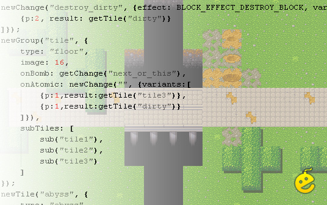

# Bombermine-tiles-demo



That old code shows how bombermine handle a lot of tiles and items.

All tiles and items are described by code, which builds simple class tables, which can be transmitted to client.

[JS config](conf/tiles.js) can run on both server and client (GWT), so there is no need to transmit class tables through websockets.

[Groovy config](conf/tiles.groovy) and [JRuby config](conf/tiles.groovy) runs only by the server.

## Building & Testing
Install [Gradle](http://www.gradle.org/)
```shell
gradle clean test -i
# if you want use eclipse to view the sources
gradle eclipse
```

You can launch the [Test](src/test/java/com/bm/model/server/conf/ScriptTest.java) from IDE. 

## Scripts

Configuration can be built with both [JS script](conf/tiles.js) and [groovy script](conf/tiles.groovy)

## License: [CC BY-NC](http://creativecommons.org/licenses/by-nc/3.0/)

## Authors:
 * Ivan Popelyshev (ivan.popelyshev@gmail.com)
